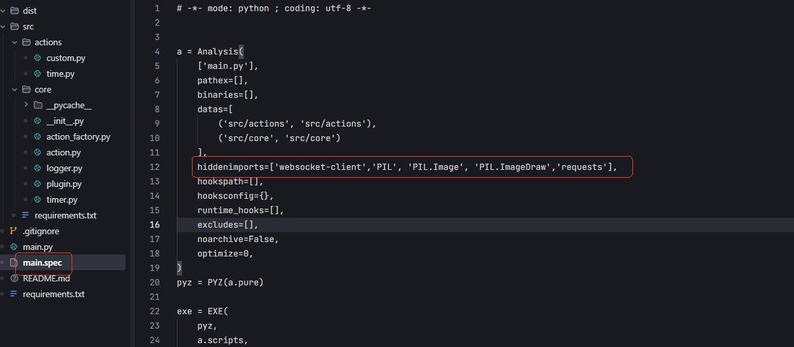

# Cover Art Plugin for Steam Dock

Windows Media Cover Art displayed in a button on a AJAZZ Stream Dock device

## Features

- Live display of cover art based on current media
- Fallback to default image if no media playing


## Installation

- Coming soon


## Development Environment Setup and Build

1. Create virtual environment:
```bash
python -m venv venv
```

2. Activate virtual environment:
- Windows:
```bash
venv\Scripts\activate
```

3. Install dependencies:
```bash
pip install -r requirements.txt
```

4. Use PyInstaller to package into an executable file:
```bash
pyinstaller main.spec
```

5. Move produced executable into com.wrth.mediacover and optionally rename executable to MediaCover.exe

6. Copy com.wrth.mediacover to COMING SOON

## Note

If you encounter module not found errors, this is because `action_factory.py` uses `importlib.import_module` to dynamically load classes under `actions`, and `PyInstaller` statically analyzes code during packaging. PyInstaller will consider modules only used in `action` as unused and won't package them into the exe. We can directly add the relevant modules to `hiddenimports` manually to resolve this.

